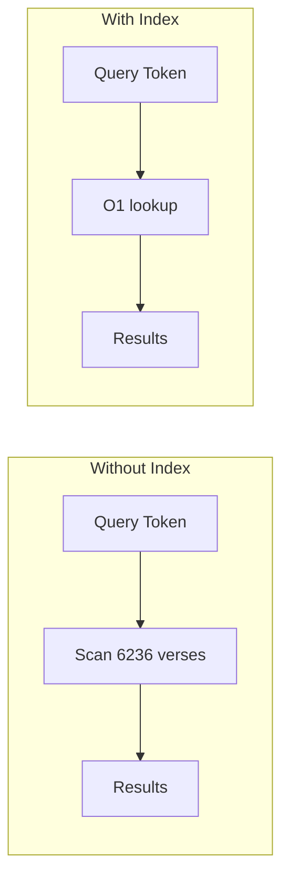
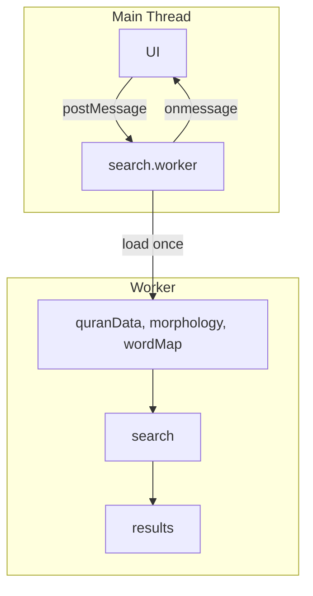

# Performance Guide

> 📍 This guide is located at `docs/performance.md`.

This guide explains how to **measure** and **optimize** the performance of `quran-search-engine`. It covers benchmarking, caching, inverted indices, and worker offloading.

> **See also:** [README](../README.md) · [Performance Optimization in README](../README.md#performance-optimization-advanced) · [Documentation Index](./index.md)

## Table of Contents {#table-of-contents}

- [Benchmarking Guide](#benchmarking-guide)
  - [Data Loading](#data-loading)
  - [Index Build Time](#index-build-time)
  - [Search Latency](#search-latency)
  - [Memory Footprint](#memory-footprint)
  - [Full Benchmark Script](#full-benchmark-script)
- [LRU Cache Usage](#lru-cache-usage)
- [Inverted Index Optimization](#inverted-index-optimization)
- [Pre-built Fuse Index](#pre-built-fuse-index)
- [Worker Offloading](#worker-offloading)
- [Architecture Overview](#architecture-overview)

---

## Benchmarking Guide

### Data Loading

Data loading is a **one-time cost**. Load datasets once at startup and reuse them.

```typescript
import { loadQuranData, loadMorphology, loadWordMap } from 'quran-search-engine';

const start = performance.now();
const [quranData, morphologyMap, wordMap] = await Promise.all([
  loadQuranData(),
  loadMorphology(),
  loadWordMap(),
]);
const loadTime = performance.now() - start;

console.log(`Data loading: ${loadTime.toFixed(2)}ms`);
console.log(`  Verses: ${quranData.length}`);
```

> **Node.js:** Use `performance.now()` (available globally in Node 16+). For older Node, use `import { performance } from 'node:perf_hooks';`.

### Index Build Time

Measure how long it takes to build or load the inverted index:

```typescript
import { buildInvertedIndex, loadInvertedIndex } from 'quran-search-engine';

// Option A: Build at runtime (CPU cost)
const t0 = performance.now();
const invertedIndex = buildInvertedIndex(morphologyMap, quranData);
console.log(`buildInvertedIndex: ${(performance.now() - t0).toFixed(2)}ms`);

// Option B: Load pre-built index (faster startup)
const t1 = performance.now();
const invertedIndexLoaded = await loadInvertedIndex();
console.log(`loadInvertedIndex: ${(performance.now() - t1).toFixed(2)}ms`);
```

### Search Latency

Search latency varies with options (lemma, root, fuzzy). Measure with `performance.now()`:

```typescript
import { search } from 'quran-search-engine';

const start = performance.now();
const result = search(
  'نار -جهنم',
  quranData,
  morphologyMap,
  wordMap,
  { lemma: true, root: true },
  { page: 1, limit: 20 },
  undefined, // preComputedFuseIndex
  cache,     // optional LRU cache
  invertedIndex,
);
const elapsed = performance.now() - start;

console.log(`Search took ${elapsed.toFixed(2)}ms (${result.pagination.totalResults} results)`);
```

Approximate timings (hardware-dependent):

| Configuration          | Typical Range | Notes                    |
|------------------------|---------------|---------------------------|
| Simple (lemma/root off)| 5–30 ms       | Linear scan               |
| Lemma + Root           | 20–80 ms      | Faster with inverted index|
| Full (incl. fuzzy)     | 100–500 ms    | Fuse.js rebuild per call  |

### Memory Footprint

#### Node.js

```typescript
const before = process.memoryUsage();
// ... load data or run search ...
const after = process.memoryUsage();

const heapDelta = (after.heapUsed - before.heapUsed) / 1024 / 1024;
console.log(`Heap increase: ${heapDelta.toFixed(2)} MB`);
console.log(`RSS: ${(after.rss / 1024 / 1024).toFixed(2)} MB`);
```

#### Browser (Chrome DevTools)

For profiling in Chrome, use the **Memory** tab in DevTools to take heap snapshots before and after loading data.

### Full Benchmark Script

Run a complete benchmark with `npx tsx`:

```typescript
// scripts/benchmark.ts
import {
  loadQuranData,
  loadMorphology,
  loadWordMap,
  loadInvertedIndex,
  buildInvertedIndex,
  search,
  LRUCache,
  createArabicFuseSearch,
} from 'quran-search-engine';
import type { SearchResponse } from 'quran-search-engine';

async function main() {
  // --- Data Loading ---
  const mem0 = process.memoryUsage().heapUsed;
  const t0 = performance.now();
  const [quranData, morphologyMap, wordMap] = await Promise.all([
    loadQuranData(),
    loadMorphology(),
    loadWordMap(),
  ]);
  const loadTime = performance.now() - t0;
  const mem1 = process.memoryUsage().heapUsed;

  console.log('=== Data Loading ===');
  console.log(`  Time: ${loadTime.toFixed(2)}ms`);
  console.log(`  Memory: ${((mem1 - mem0) / 1024 / 1024).toFixed(2)} MB`);

  // --- Inverted Index ---
  const t1 = performance.now();
  const invertedIndex = await loadInvertedIndex();
  const indexTime = performance.now() - t1;
  console.log(`\n=== Inverted Index ===`);
  console.log(`  loadInvertedIndex: ${indexTime.toFixed(2)}ms`);

  // --- Search Latency (avg of 5 runs) ---
  const cache = new LRUCache<string, SearchResponse>(100);
  const fuseIndex = createArabicFuseSearch(quranData, ['standard', 'uthmani']);
  const queries = ['الله', 'كتب', 'رحم', 'نار'];
  const runs = 5;

  console.log('\n=== Search Latency (avg of 5 runs) ===');
  for (const q of queries) {
    let total = 0;
    let totalResults = 0;
    for (let i = 0; i < runs; i++) {
      const start = performance.now();
      const res = search(
        q,
        quranData,
        morphologyMap,
        wordMap,
        { lemma: true, root: true },
        { page: 1, limit: 20 },
        fuseIndex,
        cache,
        invertedIndex,
      );
      total += performance.now() - start;
      totalResults = res.pagination.totalResults;
    }
    console.log(`  "${q}": ${(total / runs).toFixed(2)}ms avg (${totalResults} results)`);
  }
}

main();
```

```bash
npx tsx scripts/benchmark.ts
```

---

## LRU Cache Usage

The library is **stateless**. Every `search()` call runs the full pipeline unless you pass a cache. Use the built-in `LRUCache` and pass it as the **8th parameter** to `search()`.

### Why Cache?

- Repeated identical queries (same query, options, pagination) bypass the pipeline
- Useful for autocomplete, pagination, and back navigation

### How to Use

> [!WARNING]
> Use `new LRUCache(500)` — capacity is a number, not `{ max: 500 }`. Copying older examples that use `{ max: 500 }` will cause a runtime error.

```typescript
import { search, LRUCache } from 'quran-search-engine';
import type { SearchResponse } from 'quran-search-engine';

const cache = new LRUCache<string, SearchResponse>(500);

const result = search(
  'الله الرحمن',
  quranData,
  morphologyMap,
  wordMap,
  { lemma: true, root: true },
  { page: 1, limit: 20 },
  undefined,  // preComputedFuseIndex
  cache,      // 8th param — cache key is built internally from { query, options, pagination }
  invertedIndex,
);
```

The cache key is generated internally as `JSON.stringify({ query, options, pagination })`, so different pages or options get separate entries.

---

## Inverted Index Optimization

Without an inverted index, the engine does linear scans over all 6,236 verses per token. Passing an `InvertedIndex` enables **O(1)** lemma/root/word lookups.



### Build vs Load

| Method                 | Use Case                         | Startup Cost | Memory       |
|------------------------|----------------------------------|--------------|--------------|
| `buildInvertedIndex()` | You already have morphology/data | ~50–200 ms   | +5–15 MB     |
| `loadInvertedIndex()`  | Production, pre-built index      | Lower        | Loaded from JSON |

### Usage

```typescript
import {
  buildInvertedIndex,
  loadInvertedIndex,
  search,
} from 'quran-search-engine';

// Option 1: Build from loaded data
const invertedIndex = buildInvertedIndex(morphologyMap, quranData);

// Option 2: Load pre-built (recommended for production)
const invertedIndex = await loadInvertedIndex();

// Pass as 9th param to search()
const result = search(
  query,
  quranData,
  morphologyMap,
  wordMap,
  options,
  pagination,
  preComputedFuseIndex,
  cache,
  invertedIndex,  // 9th param
);
```

---

## Pre-built Fuse Index

When `fuzzy` is enabled (default), the engine builds a Fuse.js index per call. Pass a **pre-built** index as the **7th parameter** to reuse it.

```typescript
import { createArabicFuseSearch, search } from 'quran-search-engine';

// Build once at startup
const fuseIndex = createArabicFuseSearch(quranData, ['standard', 'uthmani']);

// Reuse across searches
const result = search(
  query,
  quranData,
  morphologyMap,
  wordMap,
  options,
  pagination,
  fuseIndex,  // 7th param — skips per-call index rebuild
  cache,
  invertedIndex,
);
```

---

## Worker Offloading

`search()` is **synchronous and CPU-bound**. Long searches can block the main thread. Web Workers keep the UI responsive.



### Worker Pattern

Load data **inside** the worker (avoid transferring large datasets via `postMessage`):

```typescript
// search.worker.ts
import {
  loadQuranData,
  loadMorphology,
  loadWordMap,
  loadInvertedIndex,
  search,
} from 'quran-search-engine';
import type { SearchResponse, SearchOptions, PaginationOptions } from 'quran-search-engine';

let quranData: Awaited<ReturnType<typeof loadQuranData>>;
let morphologyMap: Awaited<ReturnType<typeof loadMorphology>>;
let wordMap: Awaited<ReturnType<typeof loadWordMap>>;
let invertedIndex: Awaited<ReturnType<typeof loadInvertedIndex>>;

self.onmessage = async (e: MessageEvent) => {
  const { type, payload, id } = e.data;

  if (type === 'init') {
    [quranData, morphologyMap, wordMap, invertedIndex] = await Promise.all([
      loadQuranData(),
      loadMorphology(),
      loadWordMap(),
      loadInvertedIndex(),
    ]);
    self.postMessage({ type: 'ready', id });
    return;
  }

  if (type === 'search') {
    const { query, options, pagination } = payload;
    const response: SearchResponse = search(
      query,
      quranData,
      morphologyMap,
      wordMap,
      options ?? { lemma: true, root: true },
      pagination ?? { page: 1, limit: 20 },
      undefined,
      undefined,
      invertedIndex,
    );
    self.postMessage({ type: 'results', payload: response, id });
  }
};
```

### Main Thread

```typescript
const worker = new Worker(
  new URL('./search.worker.ts', import.meta.url),
  { type: 'module' },
);

worker.postMessage({ type: 'init', id: 'init-1' });

worker.onmessage = (e) => {
  const { type, payload, id } = e.data;
  if (type === 'ready') console.log('Search engine ready');
  if (type === 'results') {
    // Update UI with payload (SearchResponse)
  }
};

worker.postMessage({
  type: 'search',
  id: 'search-1',
  payload: {
    query: 'الله',
    options: { lemma: true, root: true },
    pagination: { page: 1, limit: 20 },
  },
});
```

### Caveats

- Load data inside the worker; avoid cloning large datasets with `postMessage`
- Use `new URL('./worker.ts', import.meta.url)` for Vite/Webpack 5+/Next.js
- Each worker holds its own data copy; multiple workers increase memory use

---

## Architecture Overview

```mermaid
flowchart TB
  subgraph Input
    Q[Query]
    Q --> R[Range?]
    Q --> Re[Regex?]
    Q --> N[Normalize]
  end

  R -->|yes| ROut[Range results]
  Re -->|yes| ReOut[Regex results]
  N --> Cache{In cache?}

  Cache -->|yes| Out[Results]
  Cache -->|no| S[Search Pipeline]

  S --> SS[Simple Search]
  S --> LS[Linguistic Search]
  S --> Sem[Semantic Search]
  SS --> Merge[Merge & Score]
  LS --> Merge
  Sem --> Merge
  Merge --> Out

  subgraph Indices
    II[InvertedIndex]
    Fuse[Fuse Index]
    II --> LS
    II --> SS
    Fuse --> LS
  end
```



### Speed Profile

- **Maps:** `morphologyMap` and `wordMap` enable O(1) lookups by `gid` and token
- **Inverted index:** Lemma, root, and word → Set of GIDs for O(1) matching
- **Regex:** Linear scan with ReDoS protection; single-digit ms for typical patterns

### Memory and Edge Runtimes

Loading all datasets increases memory. For Cloudflare Workers, Vercel Edge, or AWS Lambda, ensure initialization fits within memory and execution limits.
